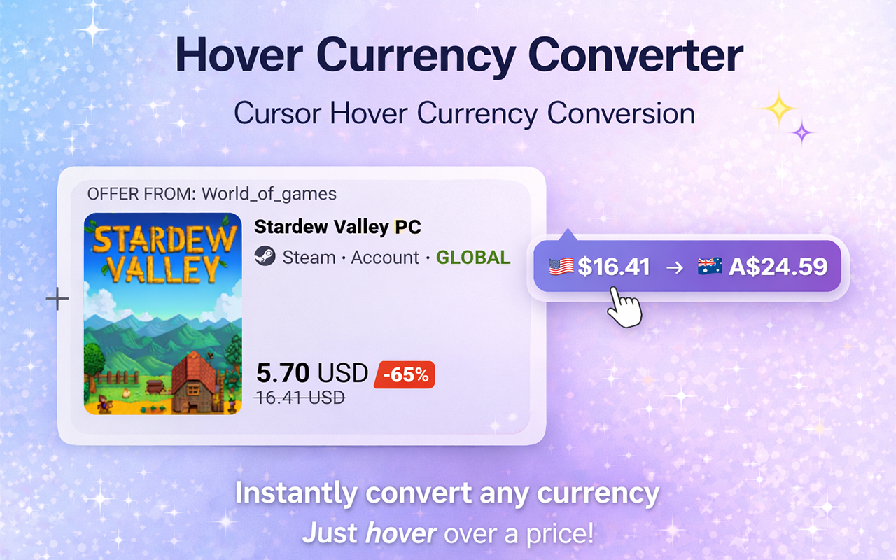

# Hover Currency Converter

<div align="center">
  
</div>

[](https://chromewebstore.google.com/detail/hover-currency-converter/plbdgcecigogedfihfmabohdbbbokfka)
[](https://chromewebstore.google.com/detail/hover-currency-converter/plbdgcecigogedfihfmabohdbbbokfka)

<div align="center">
  
</div>

Convert currency prices on hover - see converted values instantly when hovering over prices on any website.

## 🌟 Features

- **Instant Hover-to-Convert Tooltip** - Hover over prices like `$19.99`, `€49`, or `19.99 USD` to see instant conversions
- **Works on Any Website** - Automatically detects prices in various formats across all websites
- **Customizable Target Currency** - Choose your preferred currency in the side panel
- **Quick Converter** - Use the side panel for manual currency conversions
- **Smart Caching** - Exchange rates are cached to minimize network usage
- **Easy Toggle** - Enable or disable the extension with one click
- **Clean Design** - Non-intrusive tooltip design that doesn't interfere with browsing
- **Privacy-First** - No personal data collection, all processing happens locally

## 📦 Installation

Install from the Chrome Web Store:

**[Install Hover Currency Converter](https://chromewebstore.google.com/detail/hover-currency-converter/plbdgcecigogedfihfmabohdbbbokfka)**

## 🚀 How to Use

1. **Install the extension** from the Chrome Web Store
2. **Open the side panel** by clicking the extension icon
3. **Select your target currency** from the dropdown menu
4. **Browse any website** and hover over prices
5. **See instant conversions** in a tooltip

### Example Usage

- Hover over `$19.99` → See conversion to your selected currency (e.g., `€18.50`)
- Hover over `€49` → See conversion to your selected currency (e.g., `$53.20`)
- Hover over `19.99 USD` → See conversion to your selected currency

## 🛠️ Technical Details

- **Manifest Version:** 3
- **Permissions:**
  - `storage` - Store user settings and cached exchange rates
  - `sidePanel` - Display the settings panel
  - `activeTab` - Access page content for currency detection
  - `scripting` - Inject content scripts for price detection

- **API:** Uses public currency exchange rate APIs:
  - `https://cdn.jsdelivr.net/npm/@fawazahmed0/currency-api@*/*`
  - `https://*.currency-api.pages.dev/*`

- **Processing:** All currency detection and conversion happens locally in your browser for privacy and speed.

## 🔒 Privacy & Security

- ✅ **No personal data collection**
- ✅ **No tracking or analytics**
- ✅ **Currency detection happens locally**
- ✅ **Exchange rates fetched from public APIs only**
- ✅ **Settings stored locally on your device**

For more details, see [PRIVACY_POLICY.md](./PRIVACY_POLICY.md)

## 📁 Project Structure

```
Hover-Currency-Converter/
├── background/
│   └── service-worker.js    # Background service worker
├── content/
│   ├── content.js           # Content script for price detection
│   └── content.css          # Styles for tooltip
├── sidepanel/
│   ├── sidepanel.html       # Side panel UI
│   ├── sidepanel.js         # Side panel logic
│   └── sidepanel.css        # Side panel styles
├── utils/
│   └── currencies.js        # Currency utilities
├── icons/                   # Extension icons
├── screenshots/             # Screenshots and banners
├── manifest.json            # Extension manifest
└── README.md               # This file
```

## 🎯 Perfect For

- Shopping on international websites
- Comparing prices across different currencies
- Understanding prices while browsing
- Quick currency conversions without leaving the page

## 🤝 Contributing

Contributions are welcome! Please feel free to submit a Pull Request.

## 📝 License

This project is open source and available for use.

## 📧 Contact

- **Developer:** Rezaul Arif
- **Email:** hi@rezaularif.com
- **Chrome Web Store:** [Hover Currency Converter](https://chromewebstore.google.com/detail/hover-currency-converter/plbdgcecigogedfihfmabohdbbbokfka)

## 🙏 Support

If you encounter any issues or have suggestions, please:
- Open an issue on GitHub
- Contact us at hi@rezaularif.com

---

**Made with ❤️ for easier online shopping and browsing**

